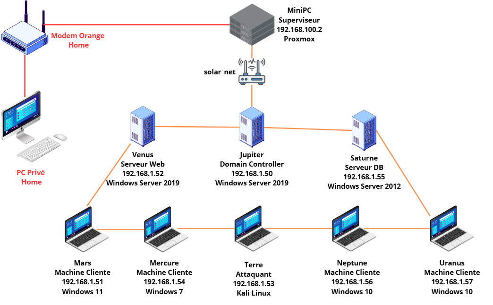
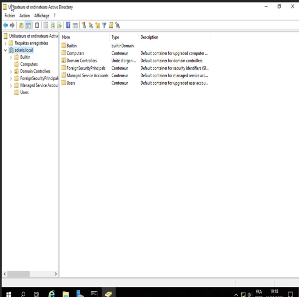
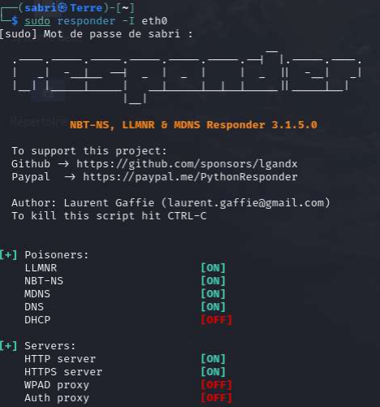

# Projet Solaris

## Overview

Projet Solaris is a personal pentesting lab designed and built from scratch to simulate a realistic enterprise environment based on Active Directory.

The project was created as a final-year cybersecurity project with the objective of building a complete lab, integrating multiple virtual machines, simulating attacks, and documenting the methodology used.

This project simulates a real-world internal pentest scenario starting from zero access.

## Main Objectives

- Build a virtualized pentesting lab from scratch
- Simulate a small enterprise environment
- Practice attack paths in an isolated network
- Work on Active Directory, Windows and Linux systems
- Document methodology, architecture and attack scenarios

## Environment

The lab was built around:

- Proxmox
- Active Directory
- Windows Server
- Windows client machines
- Kali Linux
- Isolated internal network

## Key Topics Covered

- Lab architecture design
- Active Directory deployment
- Virtual machine creation and configuration
- Network segmentation and isolation
- Attack simulation and flag-based scenarios
- Pentesting methodology and documentation

## Repository Content

This repository contains a structured summary of the Solaris project:

- lab architecture
- methodology
- attack scenario examples
- selected screenshots and technical notes

## Note

This repository is a public project summary based on my final-year work.  
Full documentation is available upon request.

## Skills Demonstrated

- Active Directory deployment and management
- Network enumeration and reconnaissance (Nmap)
- LLMNR/NBT-NS poisoning attacks (Responder)
- Hash capturing and password cracking (Hashcat)
- Remote access exploitation (RDP)
- Privilege escalation techniques
- Attack path methodology (based on real pentesting workflow)
- Documentation and reporting of security findings

## Tools Used

- Nmap
- Responder
- Hashcat
- Kali Linux
- Proxmox
- Active Directory

## Screenshots

### Lab Overview

### Active Directory

### Attack Scenario

## Author

Sabri Ziani
